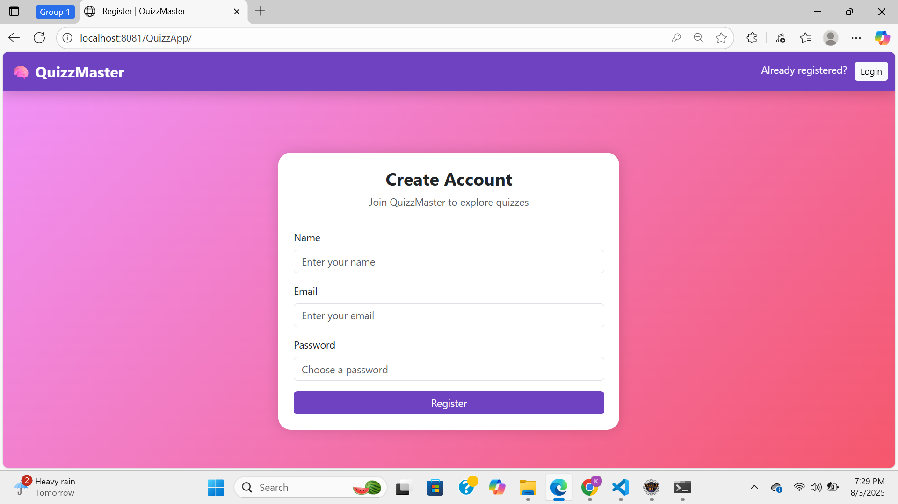
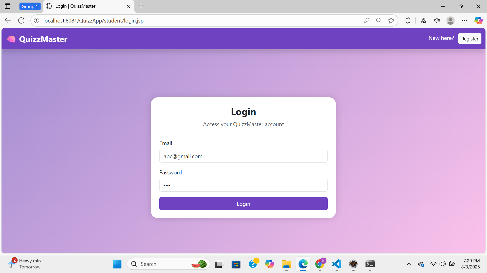
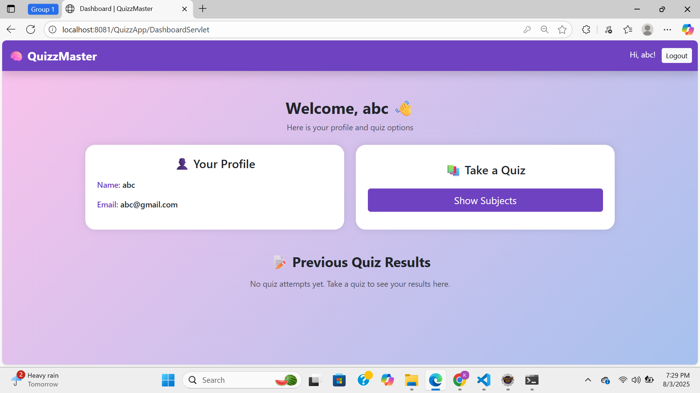
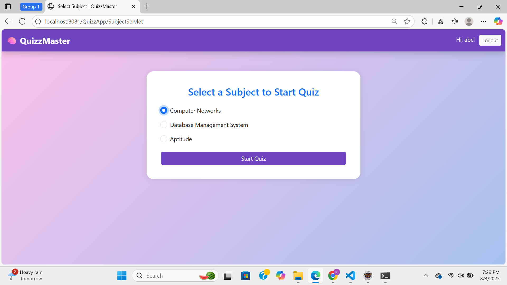
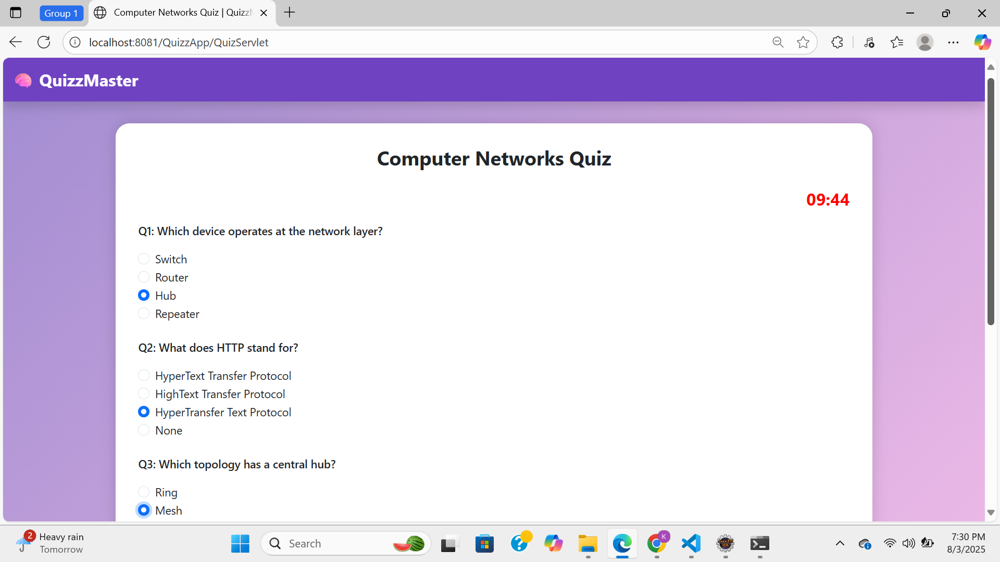
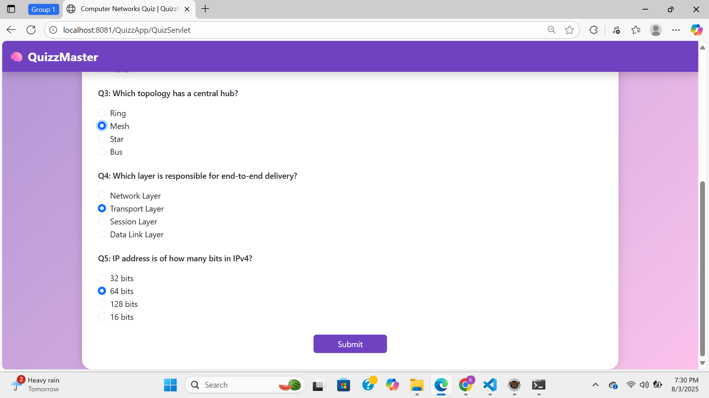
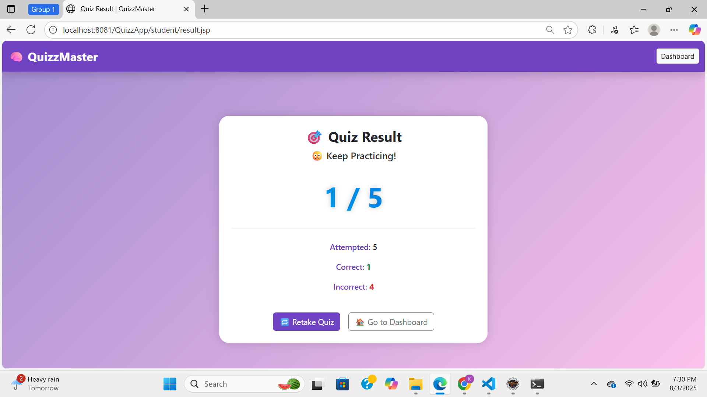

# QuizMaster 🧠📚

QuizMaster is a web-based online quiz application built using **JSP, Servlets, and JDBC**. It allows users to register, log in, take quizzes based on subjects, and view their results.

## 🚀 Features

- User Registration and Login 🔐
- Subject-wise Quiz Selection 📘
- Timer-based Quiz System ⏳
- Auto Score Calculation ✅❌
- Result Dashboard with Date & Score 📊
- Admin Panel (optional future scope)

## 🛠️ Tech Stack

- **Frontend:** HTML, CSS, JSP, BootStrap
- **Backend:** Java Servlet
- **Database:** MySQL using JDBC
- **Server:** Apache Tomcat

## 📸 Screenshots

### 1. Registration Page

### 2. Login Page

### 3. Dashboard

### 4. Subject Selection

### 5. Quiz Interface

### 6. Result Page

