# QuizMaster 🧠📚

QuizMaster is a web-based online quiz application built using JSP, Servlets, and JDBC. It allows users to register, log in, take quizzes based on subjects, and view their results. The app also includes an Admin Panel for managing quizzes and results.

## 🚀 Features

### 👨‍🎓 Student Features
- 🔐 User Registration and Login  
- 📘 Subject-wise Quiz Selection  
- ⏳ Timer-based Quiz System  
- ✅ Auto Score Calculation  
- 📊 Result Dashboard (Date & Score-wise)  
- 🔓 Secure Logout Functionality

### 🧑‍💼 Admin Features
- 🔒 Admin Login  
- ➕ Add Questions for Each Subject  
- 📂 View All Quiz Results of Students  
- 👥 View All Registered Users  
- 📊 Admin Dashboard with Quiz & Result Overview  
- 🔓 Admin Logout Functionality

## 🛠️ Tech Stack

- **Frontend:** HTML, CSS, JSP, BootStrap
- **Backend:** Java Servlet
- **Database:** MySQL using JDBC
- **Server:** Apache Tomcat

## 📸 Screenshots

### 1. Home Page

### 2. Registration Page - for User
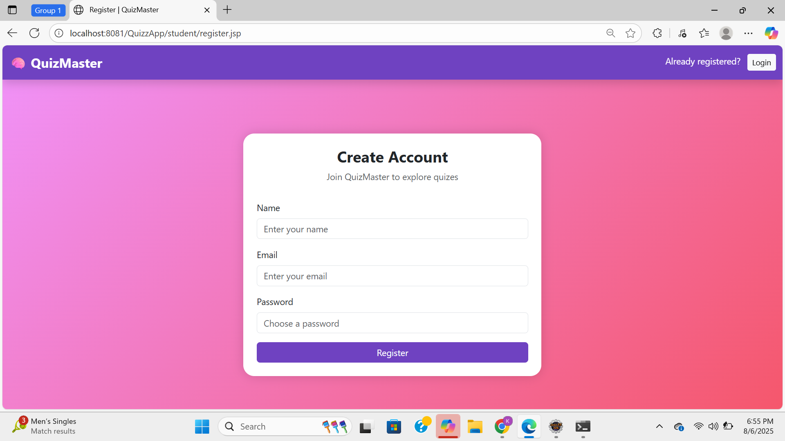

### 3. Login Page - for User
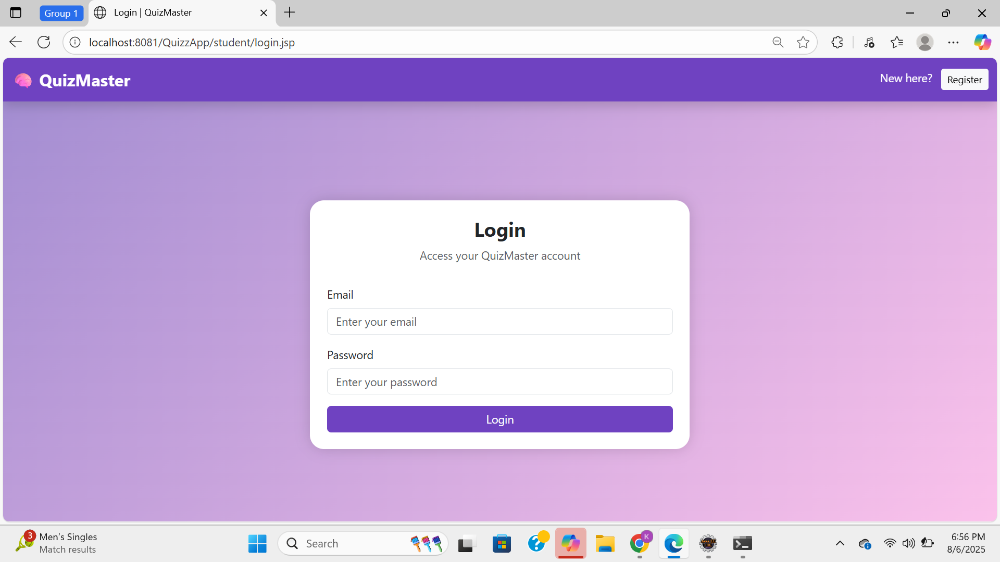

### 4. Dashboard - for User
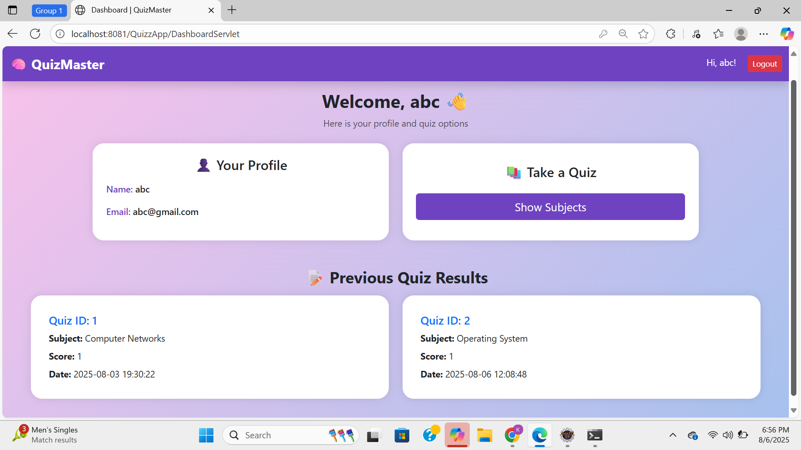

### 5. Subject Selection - for User
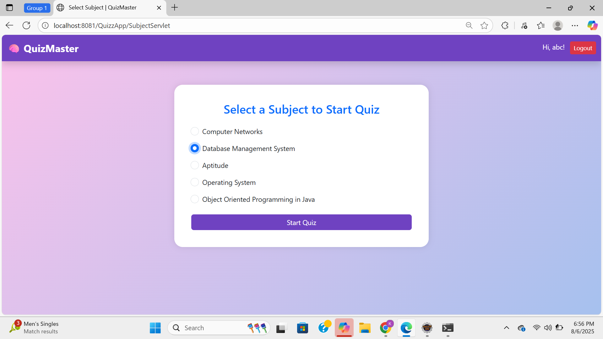

### 6. Take Quiz Page - for User
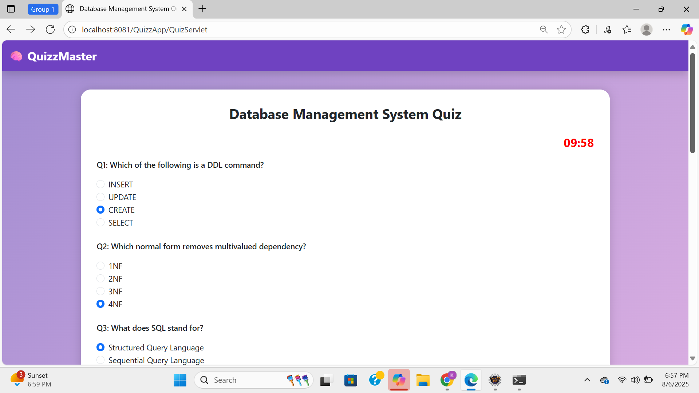
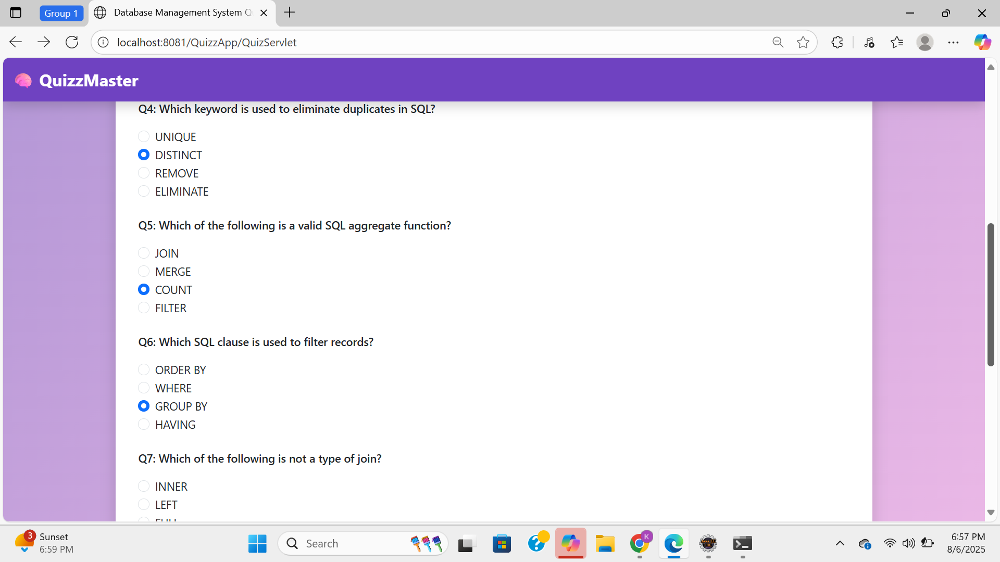
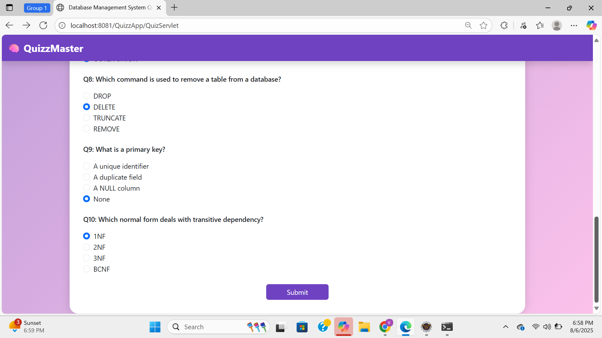

### 7. View Result Page - for User
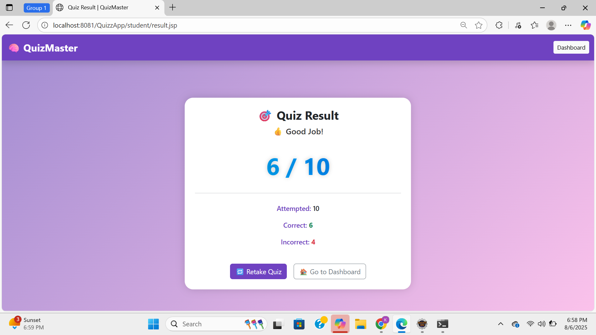

### 8. Login Page - for Admin
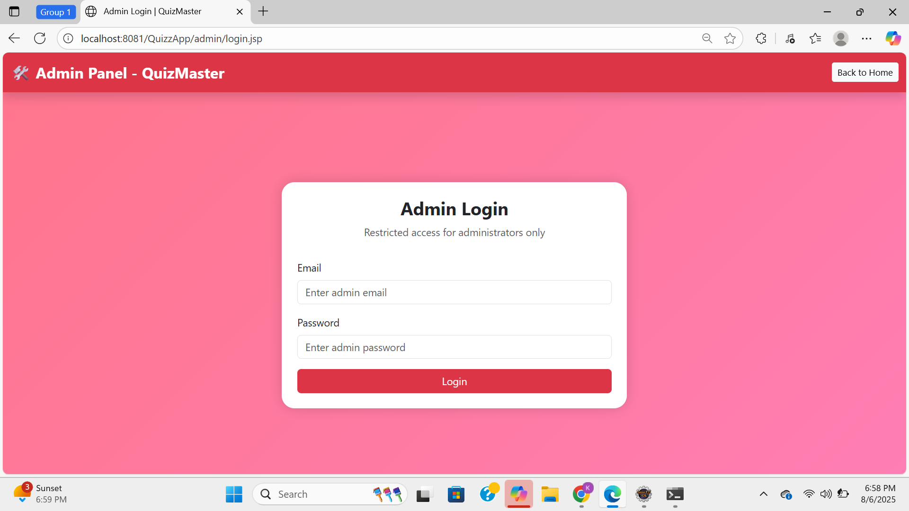

### 9. Dashboard - for Admin
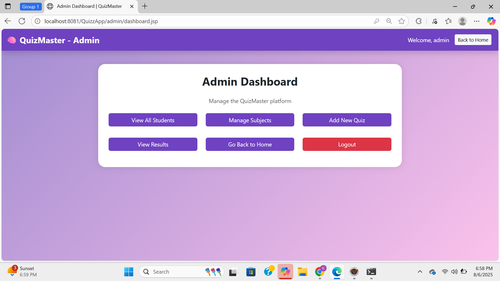

### 10. View All Registered Users - for Admin

### 11. View All Results of Users - for Admin
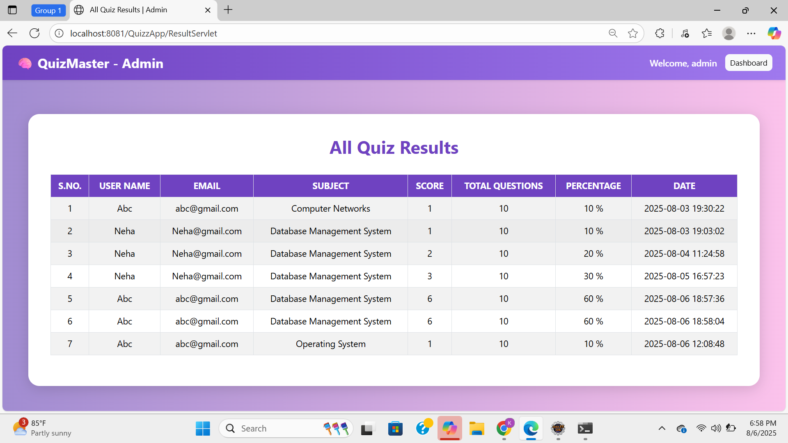

### 12. Manage Subjects - for Admin

### 13. Add Quiz - for Admin

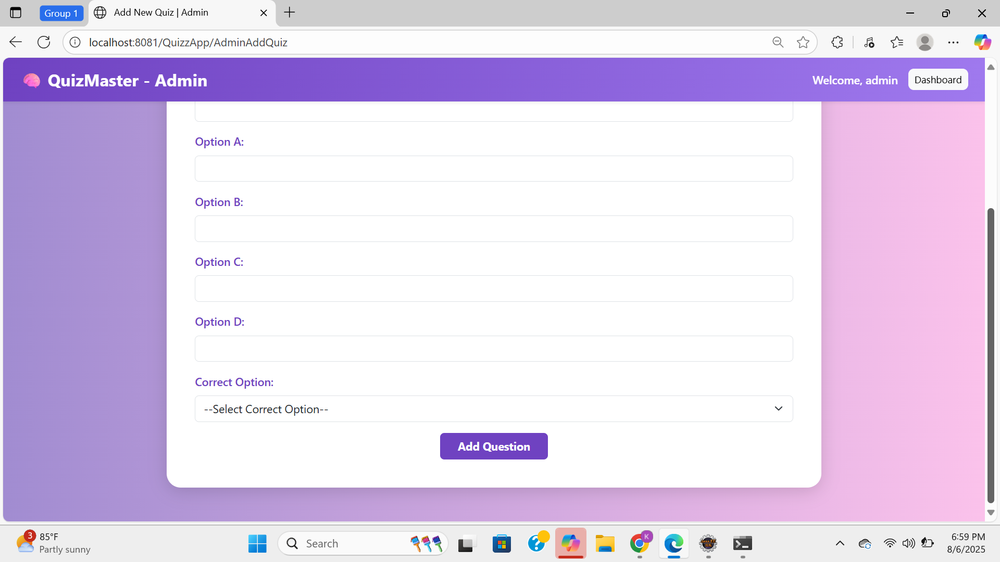
